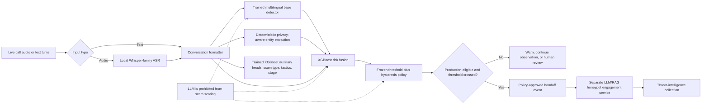
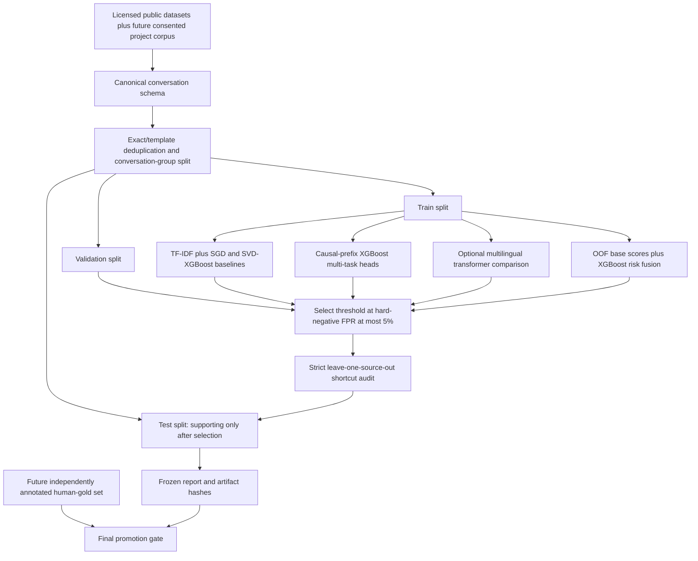

# ArrestShield ML architecture

## Runtime flow

The ML subsystem owns transcription, feature extraction, trained-model scores, thresholding, and the structured handoff event. It never calls the LLM. The honeypot is a separate downstream service and may receive a handoff only after an eligible trained detector crosses its frozen operating threshold and deployment policy permits engagement.

## Training and evaluation flow

## Trust boundaries

- Raw audio is size/type/duration checked, written only to a temporary directory, and deleted after the request.
- Sensitive entities are redacted by default. Raw values require explicit trusted-caller opt-in.
- Model checkpoints and user data are not committed to Git. Compact hashes, configuration, and metrics are committed.
- Current positive labels are entirely silver and mostly synthetic; all checked-in deployment policy therefore remains `research_only_not_promoted`.
- The frozen human-gold collection gate cannot be bypassed by synthetic data, an LLM annotation, or a high random-split score.

The laptop deployment uses the compact classical path: class-weighted SGD for the base probability, XGBoost risk fusion for the research decision score, and separate XGBoost heads for scam type, stage, and supported tactics. The auxiliary heads cannot modify `is_scam`. A transformer implementation remains available as a future controlled comparison, not as a hidden runtime dependency.
