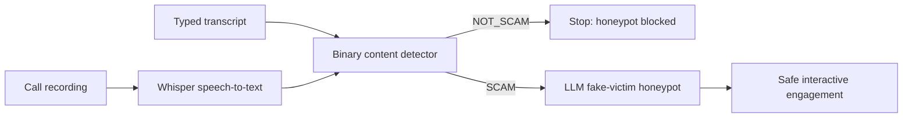

# Simple architecture

## Detection model

The binary detector uses word and character TF-IDF features with an SGD
classifier trained using logistic loss. Character features handle misspellings
and Romanized Hindi; word features capture phrases such as payment demands,
urgent verification, impersonation, secrecy, OTP requests, and threats.

## Strict separation

- Whisper is ASR, not the scam classifier.
- The trained model alone calculates the score and binary label.
- A `NOT_SCAM` result always blocks the honeypot.
- The LLM cannot provide a feature, score, threshold, or label.
- Honeypot replies use deliberately invalid demo identifiers and never perform
  a payment.
